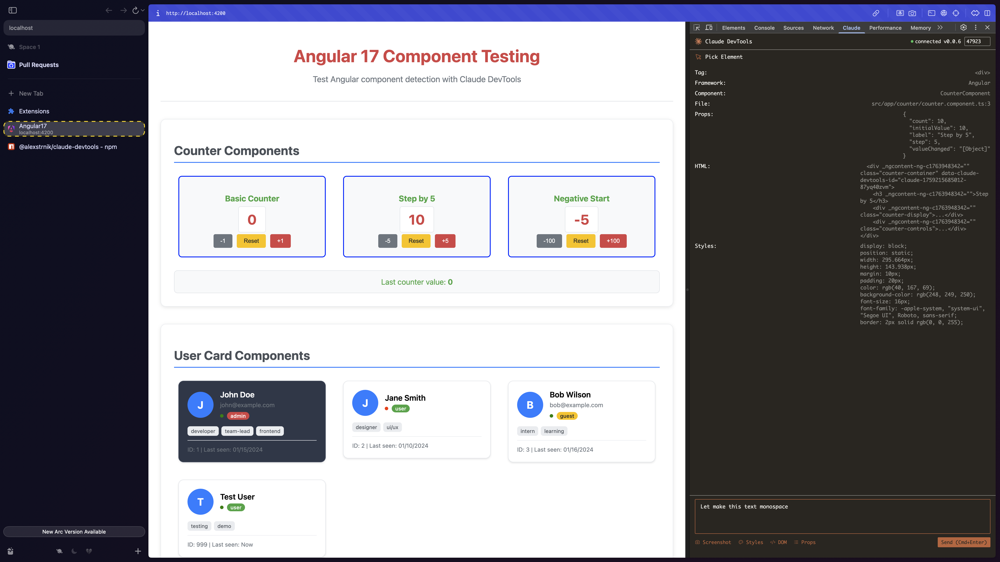

# Claude DevTools



**Fix your frontend code right from DevTools.**

Pick a component, write your prompt, and send it directly to a Claude session—without leaving the page.

---

## Quick Start

### 1. Install the host server

The host server runs in your project folder like the regular Claude CLI and listens on port `47923` for commands from the extension.

```bash
npm install -g @alexstrnik/claude-devtools
# or
pnpm add -g @alexstrnik/claude-devtools
```

### 2. Install the Chrome extension

**Option A: Download latest release** (Easiest)
1. Go to [Releases](https://github.com/AlexStrNik/claude-devtools/releases/latest)
2. Download `claude-devtools-extension-vX.X.X.zip`
3. Open Chrome → Extensions → Enable **Developer mode**
4. **Drag and drop** the zip file directly onto the Extensions page

**Option B: Clone from source**
1. Clone this repo: `git clone https://github.com/AlexStrNik/claude-devtools`
2. Open Chrome → Extensions → Enable **Developer mode**
3. Click **Load unpacked** → select `chrome-devtools-extension` folder

### 3. Start the host server

```bash
claude-devtools
```

---

## How it works

```
Web Page → Chrome Extension → Host Server → Claude Code PTY
```

- **Chrome Extension**: Detects components and captures element data.
- **Host Server**: Bridges your browser and Claude Code, manages the PTY, handles images, queues requests, and maintains persistent sessions.
- **Claude Code**: Receives full context for debugging or live modifications.

---

## Using Claude DevTools

1. Start the host server (`claude-devtools`)
2. Open DevTools → **Claude DevTools** tab
3. Click **Pick Element** → select a component
4. Write your prompt or question
5. Hit **Send to Claude Code**

Your element’s context is sent directly to Claude, including:

- Component name (React or Angular)
- Props
- DOM slice
- Computed styles
- Screenshots (macOS only)
- File path

---

## Features

- **React support**: Extracts component names, props, and source locations (React 18 & 19)
- **Angular support**: Full component detection with props and source mapping (Angular 17)
- **Screenshots**: Automatic element cropping for visual context (macOS only)
- **Source mapping**: Maps compiled JS back to original TypeScript files
- **Customizable context**: Include exactly what you need

---

## Development

```bash
# Clone repository
git clone https://github.com/AlexStrNik/claude-devtools

# Install host dependencies
cd claude-devtools-host
pnpm install

# Start development server
pnpm dev

# Load extension in Chrome DevTools
```

---

## Examples

- `react-example-18` – React 18 test app
- `react-example-19` – React 19 test app
- `angular-17` – Angular 17 test app

---

## Todo / Roadmap

- Support more frameworks (currently React & Angular)
- Add image support on Linux/Windows
- Port control directly in extension UI
- Improve React 19+ source path detection
